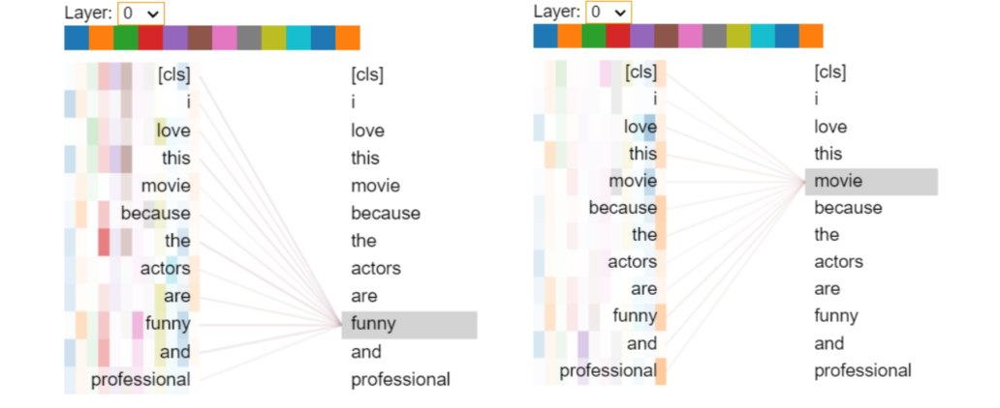

### BERT Implementation from Scratch

This repository contains an implementation of the BERT model from scratch, step by step, as detailed in the provided `transformer.ipynb` notebook. BERT, short for Bidirectional Encoder Representations from Transformers, is a pre-trained transformer-based model developed by Google AI, known for its state-of-the-art performance in various natural language processing tasks.

#### Content:

1. **Encoder Implementation:** The notebook walks through the implementation of the encoder layer, a key component of the transformer architecture. It explains the concepts of attention mechanisms, single-head, and multi-head attention, and demonstrates their implementation within the encoder.

2. **BERT Model Implementation:** Building upon the encoder implementation, this section extends the model to create a full BERT model. It covers the implementation of token embeddings, position embeddings, and segment embeddings, crucial components of the BERT architecture.

#### Key Concepts Covered:

- **Attention Mechanism:** The notebook provides a brief explanation of the attention mechanism and its importance in transformer-based models.
- **Single-head vs. Multi-head Attention:** It discusses the reasons behind using multi-head attention over single-head attention in the transformer architecture.

#### Instructions for Use:

1. Clone the repository to your local machine.
2. Open and run the `transformer.ipynb` notebook using Jupyter Notebook or any compatible environment.
3. Follow the step-by-step instructions to complete the implementation of the encoder and the BERT model.
4. Experiment with different hyperparameters and datasets to further explore the capabilities of the implemented model.

#### Example Usage:

After training the model on the provided dataset, you can generate embeddings for input sentences. For example:

```python
input_sentence = "I liked this movie."
output_embedding = bert_model(input_sentence)
print("Output Embedding:", output_embedding)
```

## Results:
Upon running the provided example or your custom input sentences, the model will generate embeddings representing the contextualized representations of the input tokens. These embeddings can be further utilized for downstream tasks such as sentiment analysis, named entity recognition, question answering, etc.

*example:*
 `I Love this movie because the actors are funny and professional`

 

## References:
`BERT: Pre-training of Deep Bidirectional Transformers for Language Understanding by Jacob Devlin et al.
Attention is All You Need by Ashish Vaswani et al.`